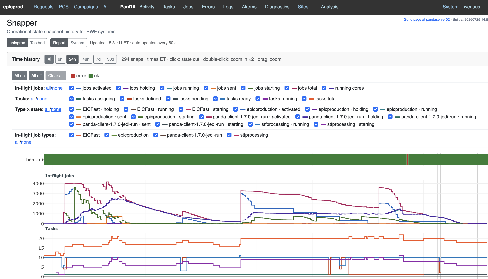
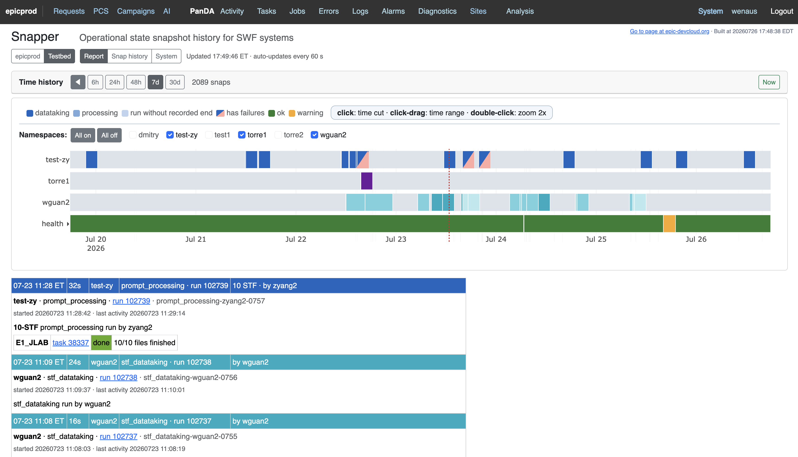

# Time history — display design

The design of the Snapper report page's temporal display, set 2026-07-23
after operator review of the first build. The quality bar is explicit:
a display that would not embarrass us in the HL-LHC or ePIC control
room. Prior art: Perfetto's track-plus-selection-panel model, Grafana's
state-timeline and shared-crosshair discipline, control-room strip
tools' single state-color vocabulary.

The delivered display in both scopes, served publicly:
[epicprod](https://epic-devcloud.org/prod/snapper/epicprod/report/?window=24h) ·
[testbed](https://epic-devcloud.org/prod/snapper/testbed/report/?window=7d).

*epicprod: the health lane and stacked curve panels — in-flight jobs and
tasks by state — with per-curve selection controls, over a 24-hour window.*

*testbed: full-height namespace activity bands carrying workflow datataking
and processing tiles, with STF task and workflow-execution curve selections
and the health lane, over a seven-day window.*

## Three zones, one time axis

1. **Tracks** — set 2026-07-24 after operator review at wide windows:
   namespace lanes are full-height bands carrying true workflow
   activity periods. A continuous grey track says the namespace exists
   and is idle; discrete tiles interrupt it where workflows actually
   ran — a solid tile for the datataking window opening into a lighter
   tile for the processing tail, assembled from the state-event record
   where it exists and the universal run record otherwise, workflow
   identity joined through the execution record. A run with no
   recorded end renders hatched. Tiles keep a zoom-aware minimum
   visual width so short runs read as blocks at any scale, with true
   proportions returning on zoom; the plot enhances the truth into
   legibility (set 2026-07-26) — the minimum is a legible block, never
   a sliver. Keyed activities visible in the view are numbered by time
   range (transparent markers above the tiles): the displayed interval
   divides into 20 equal ranges and each occupied range takes the next
   number, newest first, re-derived on every zoom or lane filter. A
   number IS a time range, decoupled from any single event — events in
   the same range share it, across lanes too, so numbers are never
   overprinted and never wasted on a burst. The click model is the
   system's unchanged basis on every scope: a click IS a vertical
   time slice — the red line lands at the clicked instant, the URL
   carries it (?cut=, selection alongside as ?sel=) — and everything
   below the plot renders what the slice crosses. A numbered story
   table sits immediately below; on a scope with activity lanes it
   replaces the state-CARD panel only: every activity at or very near
   the sliced instant resolves together — numbered hits expand their
   stories in place as subrows, unnumbered hits (unticked lane) pop
   in above the table, never silent. Clicking a row toggles its
   expansion. Lane tick-boxes sit beside the lane
   names over the plot margin (default all on, All on/off beside
   Clear all) and choose which lanes get the number treatment. A
   health-lane click toggles the health detail immediately below the
   plot at the clicked instant — a component-narrowed cut that builds
   only the health card; the recorded-state section omits the health
   card for the same reason — one home per story. Scopes without
   activity lanes (epicprod) keep the classic click-cut. Continuous state lanes (health, its
   expandable per-check sub-lanes) keep edge-to-edge bands. Recovery
   gaps are grey spans painted beneath, never over. No pips: a tile's
   leading edge is the run start.
2. **Stacked curve panels** — one compact panel per family (in-flight
   jobs, tasks, job types, type-by-state; later sites and health
   counts), each with its own y-scale and legend row, sharing the
   x-axis, crosshair, and slider.
3. **Selection panel** — never raw JSON first. Two gestures feed it:
   - **Cut (click)**: server-rendered component cards
     (`/snapper/<scope>/cut/?time=`). Consistency is by construction:
     the datataking card derives from the same run-record arcs the
     lanes draw — datataking / processing / idle per namespace with
     run and workflow — so what the bands show at the cut line is what
     the cards say. A click on a tile's inflated minimum-width extent
     snaps the cut into the activity itself; clicked green is green
     below, at any zoom. Health shows chips with non-ok check rows;
     panda shows headline stats with deltas against the previous snap.
     Every entity reference is a link; raw documents sit behind
     explicitly labeled audit foldouts; exact-event links land on
     human pages.
   - **Selection (drag a range)**: the interval story —
     changes-between summarized as field-level previous → current
     rows, plus per-curve min/mean/max over the selection.

## Cross-cutting contracts

One state-color vocabulary shared by bands, chips, and cells; stable
curve colors per curve id; Eastern time on every surface; all view
state in the URL; per-user remembered preferences; evidence honesty
throughout (actual snap times, coverage never inferred).

## Delivery landings

1. **Done (2026-07-23):** the cut as structured component cards with
   deltas and resolver links.
2. **Done (2026-07-24):** stacked per-family panels with own
   y-scales, crosshair across panels, expandable lane headers, and the
   activity-band tracks with the consistent click-snapped cut.
3. Dropped (operator decision 2026-07-24): drag stays zoom; no
   selection gesture swap.
4. **Done (2026-07-25):** window step-arrows through the recorded
   history — an arrow is absent only at a true edge, 'now' or the
   earliest snap; stepping loads the adjacent range server-side and
   the custom badge names the range. Same day the display moved into
   the snapper_ai package behind the provider registry; curve families
   and labels are provider data ([INTEGRATION.md](INTEGRATION.md)).

## Grafana position

Decided 2026-07-23: the monitor's own display is the product face —
the cut is its heart and cannot live in a dashboard tool. Grafana (the
SDCC-supported service) is a future satellite: snapper series shipped
to collaboration-visible dashboards (the MONIT pattern), provisioned
as code, consuming the same REST/SQL truth with zero coupling — a
Phase-7-adjacent add-on, not the primary display.
